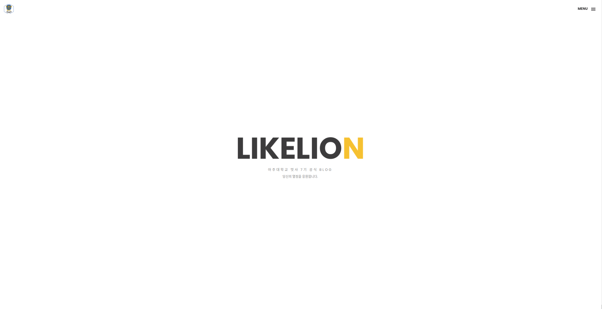
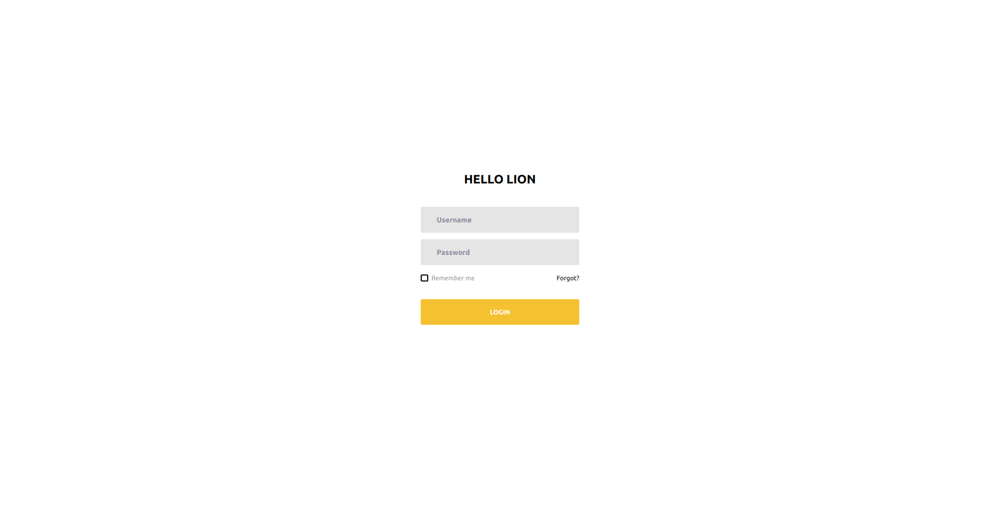
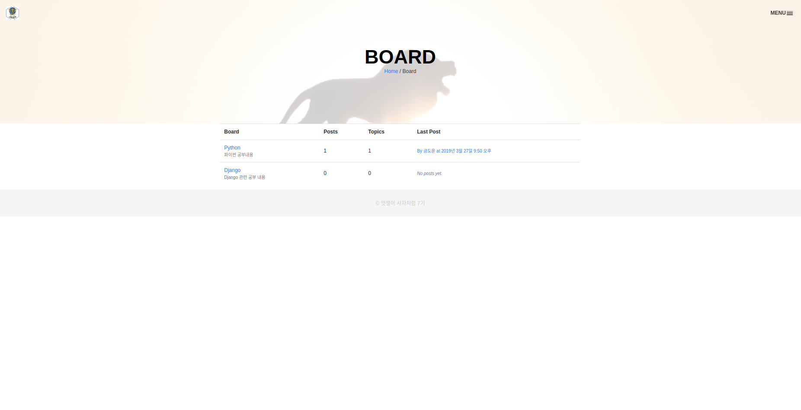
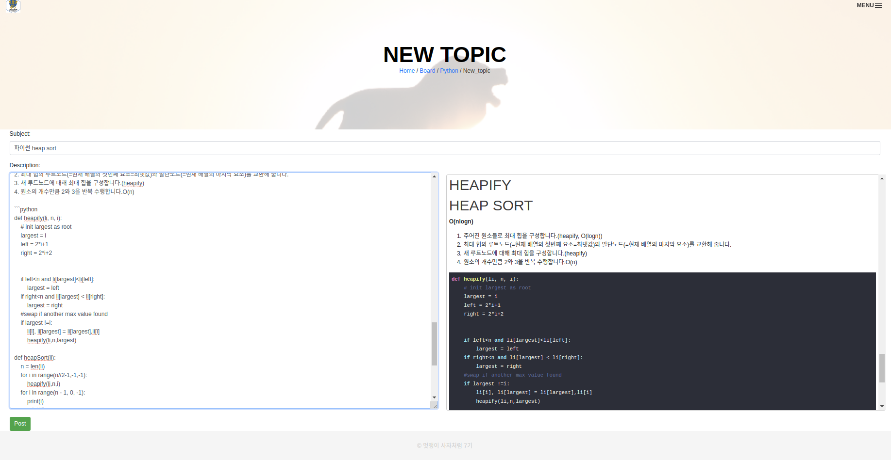
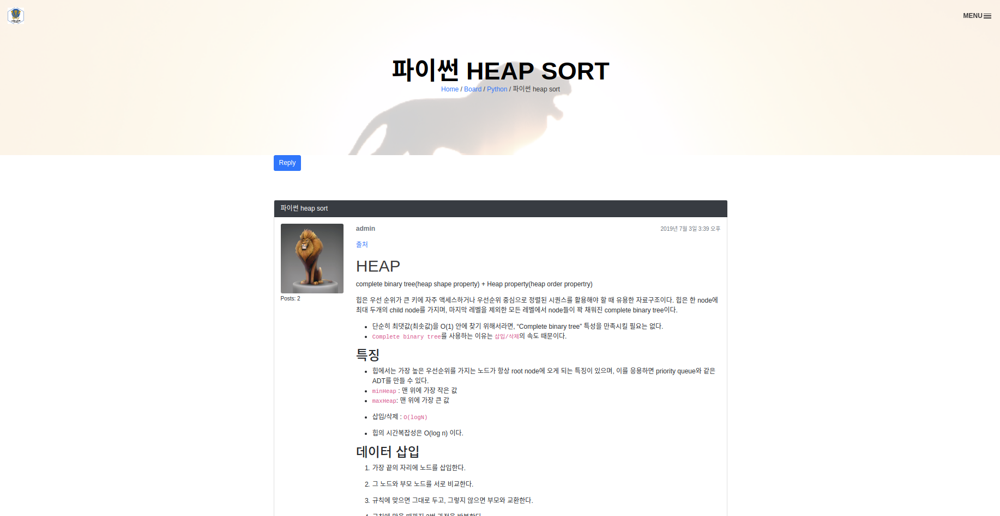

# `아주대 멋쟁이사자처럼 Blog 2019`
아주대 멋쟁이사자처럼 블로그입니다. 주로 `Django`를 통하여 개발하였습니다.

# 설명
- `Home`

- `login`

- `Profile`

- `Profile_detail`

- `Board` (`Board`:`Topic`= `1`:`n`)

- `Topic` (`Topic`:`Reply` = `1:n`, `User`:`Topic` = `1:n`,`User`:`Reply` = `1:n`)

- `Reply`

# TODO
- collectstatic aws랑 연동세팅하기
    - https://nachwon.github.io/django-deploy-7-s3/
    - https://docs.aws.amazon.com/ko_kr/elasticbeanstalk/latest/dg/create-deploy-python-django.html
    - https://lhy.kr/django-elasticbeanstalk
- Allowed host 주소 바꾸기
- http://django-env.xqf3vtenji.us-west-2.elasticbeanstalk.com/
- aws 과금 방지 세팅 알아보기 
- .gitignore static 넣어주어야 되는지
- board ux 바꾸기
